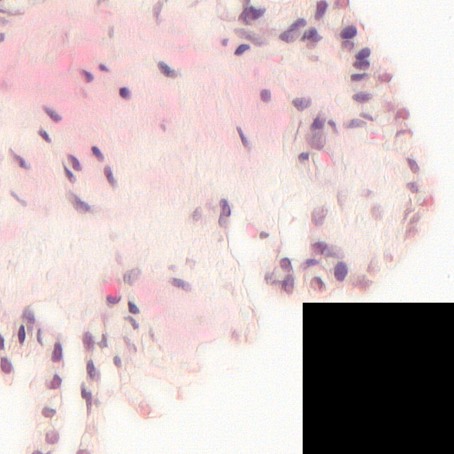
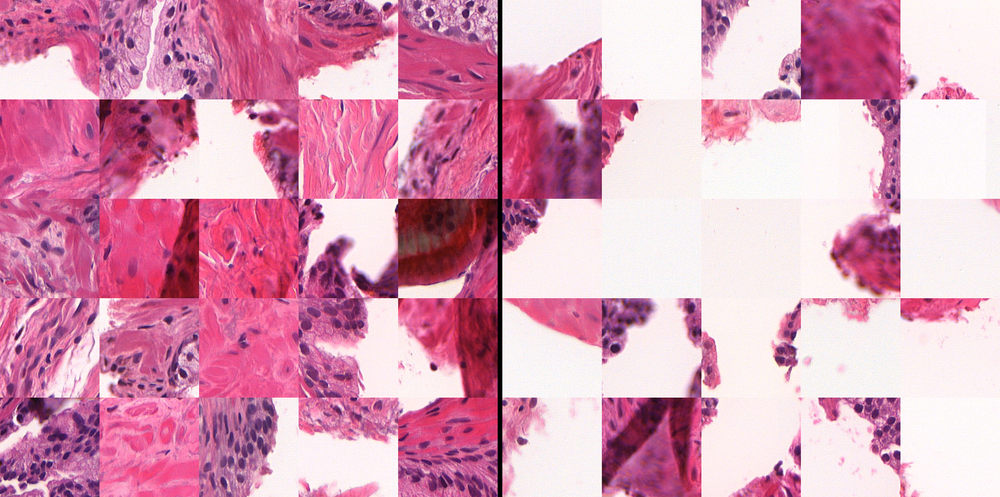
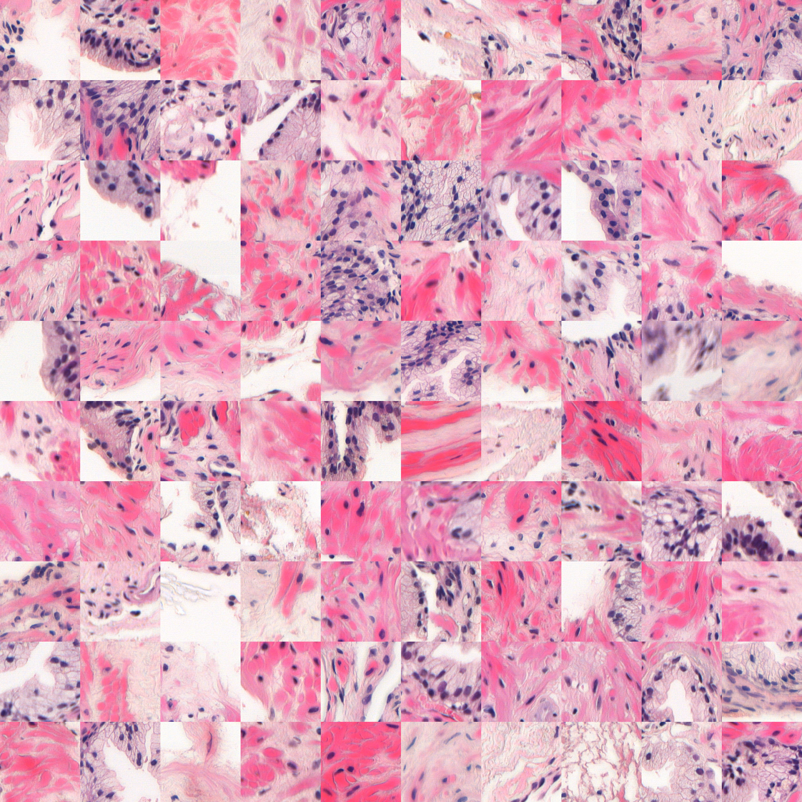

# WSI MIL Pipeline Replication & Analysis (CLAM)

## Overview
This project is an **independent replication and analysis** of a weakly supervised learning pipeline for whole-slide images (WSIs), based on the CLAM framework (Lu et al., 2021).

CLAM is an attention-based multiple instance learning (MIL) method that enables slide-level classification using only slide-level labels. A later study applied this approach to prostate biopsy data to predict cancer from morphologically benign tissue.

The goals of this project are to:
- Reproduce the applied study using the CLAM pipeline  
- Evaluate whether similar performance can be achieved  
- Investigate how data quality and signal strength affect model behavior  

---

## My Contributions
This work focuses on **pipeline structure, reproducibility, and data quality**, while keeping core algorithms unchanged.

### Pipeline & Code Structure
- Introduced a **central configuration system** controlling all steps, parameters, and paths  
- Replaced multi-command execution with a **single pipeline runner**  
- Refactored execution into **step-specific objects** for clearer structure  
- Simplified the codebase by removing unused functionality  
- Standardized path handling using `pathlib`  

### Data Quality & Diagnostics
- Implemented patch-level filtering based on:
  - Blur estimation (Laplacian)  
  - Tissue vs background ratio  
- Stored patch metrics in `.csv` for reuse and fast experimentation  
- Added visual diagnostics:
  - Accepted vs rejected patches  
  - Patch coverage validation  

### Experimental Analysis
- Investigated **low signal-to-noise conditions** in WSI data  
- Designed controlled experiments to test model sensitivity (e.g. feature amplification in positive bags)  
- Validated encoder representations on a supervised histopathology dataset  

---

### Pipeline Overview

The workflow consists of five sequential steps:

## 1. Coordinate Search
Generates `.h5` files per slide containing patch coordinates and metadata for extraction.

---

## 2. Quality Check
Computes patch-level quality metrics:
- Blur score  
- Tissue/background ratio  

Outputs:
- `.csv` file with patch metrics  
- Visualizations for validating filtering and patch coverage  

# Visualizations:
Geometry check which is an assembly of 9 neighboring patches on a WSI. Purpose is visual confirmation that there is no overlap or space between patches. A black space in place of a patch means the patch has been excluded by segmentation.


Sample patches divided into those kept (left) vs those rejected (right) for a single WSI given the set filtering parameters. Purpose to be a visual indication of how patches are filtered based on their properties before feature extraction.


Extra sample of patches approved by filter given filtering parameters for a given WSI.



---

## 3. Patch Encoding
- Filters patches based on quality thresholds  
- Encodes patches into feature vectors using a pretrained self-supervised histopathology encoder  
- Aggregates feature vectors into **bags (one per slide)**  

Also:
- Splits data into training and validation sets  
- Balances data based on patient attributes (e.g. age, PSA)  

---

## 4. Train Classifier (MIL)
- Trains CLAM-based MIL models  
- One model per fold (excluding holdout)  

Logs:
- Loss, accuracy  
- Precision / recall  
- Predictions and true positives  
- Hyperparameters per run  

---

## 5. Evaluate
- Evaluates trained models on a holdout set using cross-validation  
- Produces logs and performance summaries  

---

### Results & Findings

The primary goal was to reproduce the performance reported in the prostate biopsy study.  
Despite closely following the overall methodology, I have not yet been able to achieve comparable performance. Differences in implementation details, preprocessing, and data handling may contribute to this discrepancy.

## Observations
- Model performance remained close to **random guessing**  
- The model did not learn meaningful class separation  
- Downstream outputs such as ROC curves and heatmaps were not produced due to lack of signal  

## Attempts to Improve Performance
- Applied patch-level filtering to improve signal-to-noise ratio  
- Balanced datasets using patient attributes (e.g. age, PSA)  
- Used cross-validation  
- Conducted controlled experiments to test model sensitivity to signal  

## Interpretation
This project therefore focuses as much on understanding failure modes as on replication.

The results suggest that performance in this setting is highly sensitive to:
- Data characteristics  
- Preprocessing details  
- Potentially unreported experimental factors  

---

## Key Takeaways
- Weakly supervised MIL on WSIs is **highly sensitive to signal quality**  
- Small differences in preprocessing can significantly impact outcomes  
- Reproducing published results in low-signal medical imaging tasks is non-trivial  
- Structured pipelines and diagnostics are essential for understanding model behavior  

---

## Tech Stack
- Python  
- PyTorch  
- OpenSlide  
- h5py  
- NumPy / Pandas  

---

### Usage (High-Level)

## Installation
```bash
conda env create -f env.yml
```

## Run
1. Configure parameters in the config file  
2. Enable desired pipeline steps
3. place encoder file in the generated data folder, and confirm the path in config.py
3. Run:

```bash
python main.py
```

### References

## Method

CLAM repository: https://github.com/mahmoodlab/CLAM
CLAM paper (Lu et al., 2021): https://arxiv.org/abs/2004.09666

## Application Study

Prostate biopsy study (Scientific Reports, 2025): https://www.nature.com/articles/s41598-025-15105-6

## Data

Dataset used in this project: https://researchdata.se/en/catalogue/dataset/2024-144/1

## Encoder

Self-supervised histopathology encoder: https://github.com/ozanciga/self-supervised-histopathology

### Disclaimer

This repository is an independent replication effort.
All original methods and core algorithms are credited to the authors of the CLAM framework and the referenced study.